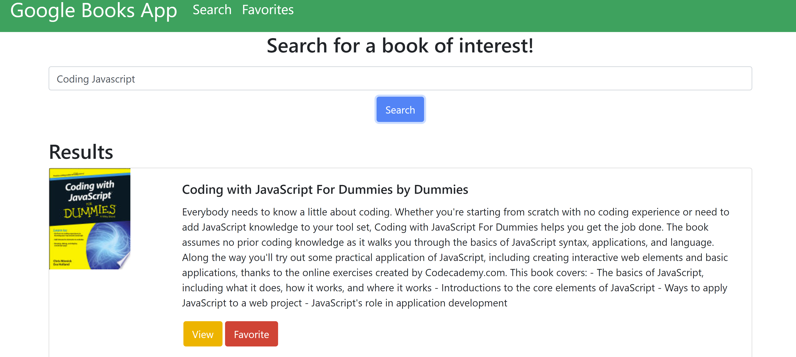
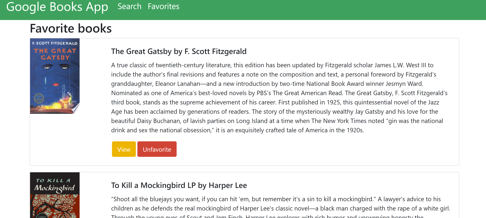

# GOOGLE BOOKS FULL STACK APP

#### DEPLOYED APP:
https://google-books-app-01.herokuapp.com/
---

---

---

#### APP DESCRIPTION:

This is a full stack MERN application in which a user can search for different books using the Google Books API. Once the user searches for a specific book, results are rendered and the user can either favorite a book or view more information about the book. If the user chooses to view more information they will be redirected to Google's Book site where they can read reviews and sample a book. When a user favorites a book, the book is sent to a Mongo Database and it's information can be viewed at any time on the Favorites page.

---

#### TECHNOLOGIES:
* React
* Node
* Express
* MongoDB
* JavaScript
* Mongoose
* Axios
* HTML
* CSS
* Bootstrap

---

#### AUTHOR:
* Keaton Sentak - [Portfolio](https://keatonsentak.com) | [GitHub](https://github.com/ksentak)
